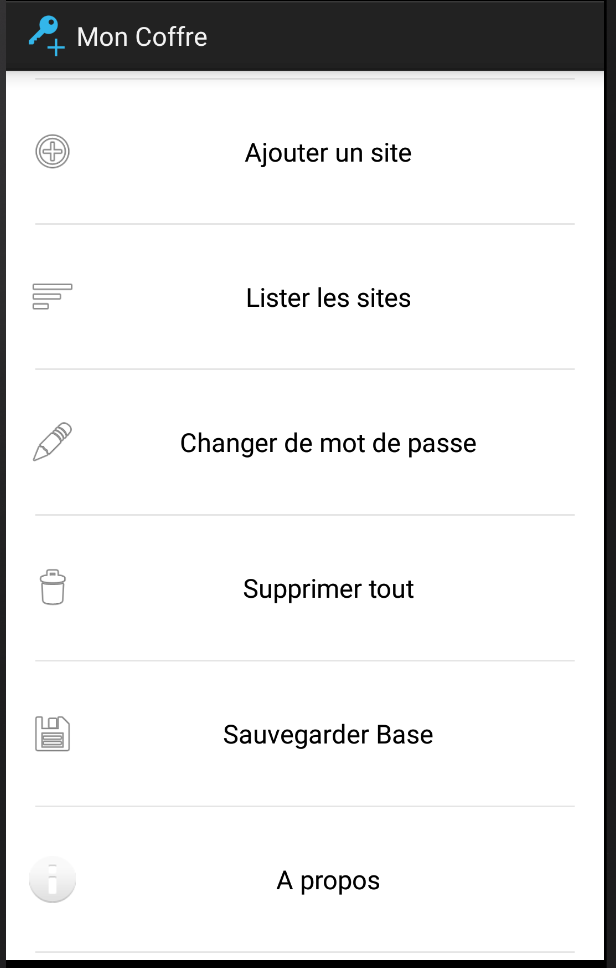

# MonCoffre
 **Application Android permettant le stockage sécurisé de vos identifiants** 
Cette application permet de stocker dans une base de données sur votre téléphone les identifiants et les mots de passe que vous utilisez pour vous connecter sur différents sites web. La base de données est chiffrée en utilisant le standard de chiffrement
AES-128. La clé de 128 bits utilisée est dérivée à partir d'un mot de passe principal saisi au lancement de l'application. La 
dérivation est effectuée en suivant le standard PBKDF2 (Password Based Key Derivation Function 2, https://tools.ietf.org/html/rfc2898). 

Contrairement à d'autres applications similaires, l'application MonCoffre ne demande pas d'autorisation d'accès à vos contacts, votre position, vos photos, etc.. Et surtout elle ne demande aucune autorisation concernant l'accès réseau vous garantissant qu'aucune donnée saisie ne sera tranmsise à votre insu via un quelconque réseau. La seule autorisation demandée est l'accès à votre espace de stockage afin de pouvoir créer une sauvegarde de la base lorsque vous cliquez sur l'option "Sauvegarder la base". 

Pour que cette option fonctionne, il est indispensable que soit installée sur votre téléphone une application mail pour laquelle vous avez configuré un compte. Dans ce cas, l'application MonCoffre créera un mail contenant en pièce jointe votre base de données chiffrée et vous pourrez envoyer ce dernier via votre application mail. Il est important ici de noter que ce n'est pas l'application MonCoffre qui envoie le mail puisqu'elle ne possède pas l'autorisation d'accès au réseau, il s'agit de l'application mail installée sur votre téléphone qui se chargera de cet envoi.

L'application MonCoffre est issue d'un projet donné aux étudiants du Master 2 DAPM de l'université de Toulon (Développement et Applications sur Plateformes Mobiles) dans le cadre du module "Protocoles Cryptographiques".

Une version directement installable se trouve dans le répertoire **app** : **MonCoffre.apk** ou directement sur http://veron.univ-tln.fr/MonCoffre.apk.

TODO :

- Développer une interface Web permettant de gérer sur un poste de travail la base de données exportée via l'option "Sauvegarder la base"
- Rajouter l'option "Mise à jour de la base" dans l'application afin de pouvoir remplacer la base de données stockée sur le téléphone par une base de données placée sur la carte SD.

